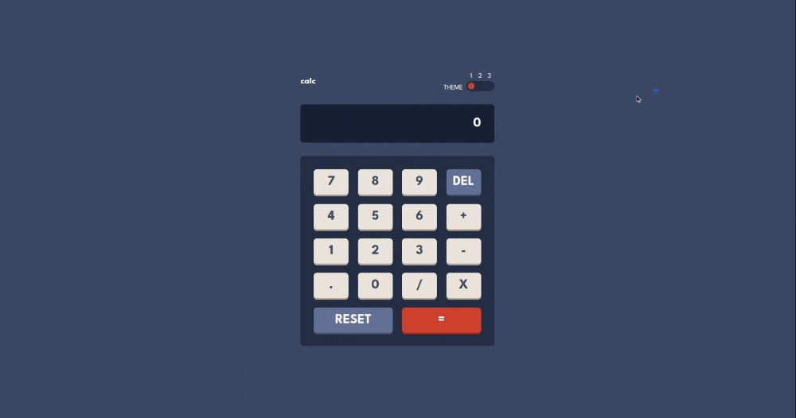

# Frontend Mentor - Calculator app solution

This is a solution to the [Calculator app challenge on Frontend Mentor](https://www.frontendmentor.io/challenges/calculator-app-9lteq5N29). Frontend Mentor challenges help you improve your coding skills by building realistic projects.

## Table of contents

- [Frontend Mentor - Calculator app solution](#frontend-mentor---calculator-app-solution)
  - [Table of contents](#table-of-contents)
  - [Overview](#overview)
    - [The challenge](#the-challenge)
    - [Screenshot](#screenshot)
    - [Links](#links)
  - [My process](#my-process)
    - [Built with](#built-with)
  - [Author](#author)
  - [Acknowledgments](#acknowledgments)

## Overview

### The challenge

Users should be able to:

- See the size of the elements adjust based on their device's screen size
- Perform mathmatical operations like addition, subtraction, multiplication, and division
- Adjust the color theme based on their preference
- **Bonus**: Have their initial theme preference checked using `prefers-color-scheme` and have any additional changes saved in the browser

### Screenshot

### Links

- Solution URL: [Github](https://github.com/code213-luffy-8-2023/chalenge-calculator)
- Live Site URL: [Link](https://chalenge-calculator.vercel.app/)

## My process

### Built with

- CSS variables
- CSS Grid
- `prefers-color-scheme` media query
- [React](https://reactjs.org/) - JS library

## Author

- Website - [LinkedIn](https://www.linkedin.com/in/rachid-boudjelida/)
- Frontend Mentor - [@humanshield89](https://www.frontendmentor.io/profile/humanshield89)

## Acknowledgments

Thanks to [Frontend Mentor](https://www.frontendmentor.io) for the challenge.

Thanks to [Vercel](https://vercel.com/) for the hosting services and the CI/CD pipeline, you guys rock!

Thanks to [React](https://reactjs.org/) for the awesome library.

Thanks to [MDN](https://developer.mozilla.org/en-US/) for the awesome documentation.

**Note: Delete this note and edit this section's content as necessary. If you completed this challenge by yourself, feel free to delete this section entirely.**
